# 第一单元作业总结--表达式展开

## 一、总体情况
三次作业总共的BNF描述如下
$$
\begin{aligned}
Expr &\rightarrow [+|-]Term|Expr[+|-]Term\newline
Term &\rightarrow [+|-]Factor|Term*Factor\newline
Factor &\rightarrow ConstFactor|ExprFactor|VarFactor\newline
ConstFactor &\rightarrow SignedInteger\newline
ExprFactor &\rightarrow (Expr)[exp]\newline
VarFactor &\rightarrow PowerFactor|TriFactor|SumFactor|FuncCall\newline
TriFactor &\rightarrow sin(Factor)[exp]|cos(Factor)[exp]\newline
exp &\rightarrow ** [+] SignedInteger\newline
SignedInteger &\rightarrow [+|-] Integer\newline
Integer &\rightarrow (0|1|2|...|9)\lbrace 0|1|2|...|9\rbrace \newline
FuncDefine &\rightarrow FuncName(FuncVar [, FuncVar [, FuncVar]])=Expr\newline
FuncVar &\rightarrow x|y|z\newline
FuncCall &\rightarrow FuncName(Factor [, Factor [, Factor]])\newline
FuncName&\rightarrow f|g|h\newline
SumFactor&\rightarrow sum(i,ConstFactor,ConstFactor,SumExpr)\newline
SumExpr &\rightarrow Factor
\end{aligned}
$$

三次作业难度递进，分别是只带一层括号的表达式展开，加入三角因子、求和函数、自定义函数的表达式展开，支持因子间嵌套的表达式展开。
由于我在第一次设计架构时已经考虑了括号嵌套，因子类型扩展这两方面，因此从第一次作业到第二、三次作业迭代的过程中没有进行架构上的重构。
总体处理流程如下
$$
读入\to预处理\to解析表达式\to括号展开\to三角优化等\to输出
$$
总体文件树如下
```
─src
    │  MainClass.java
    │  
    ├─expression
    │      BasicTerm.java
    │      Cos.java
    │      Expr.java
    │      Factor.java
    │      Func.java
    │      Power.java
    │      Sin.java
    │      Sum.java
    │      Term.java
    │      Variable.java
    │      
    └─parser
            Parser.java
            Token.java
```


## 二、架构设计度量分析与迭代
### 2.1、输入处理包（parserPackege）
输入处理包包含两个类，分别是用于识别字符串信息的Token类和用于递归下降构建表达式的Parser类。UML如下

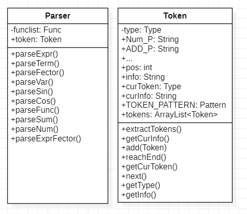
#### 2.1.1Token类分解字符串
可以发现，这次作业中的输入可以分为一系列不可再分的基本单元，例如带符号数字`NUM`，幂运算符号`“**”EXP`等，如果按照单个字符扫描的方法，一个个字符扫描，就会把这些本来具有整体意义的符号拆开，增加处理难度。因此我选择用正则表达式整体识别这些式子中不可再分的部分。
```java
private static final String ADD_P = "(?<ADD>\\s*\\+\\s*)";
    private static final String SUB_P = "(?<SUB>\\s*-\\s*)";
    private static final String NUM_P = "(?<NUM>\\s*([+-]?)(\\d+)\\s*)";
    ...//一些基本单元的正则表达式
    
    private static final Pattern TOKEN_PATTERN = Pattern.compile(ADD_P + "|" + SUB_P +
            "|" + EXP_P + "|" + NUM_P + "|" + LP_P +
            "|" + RP_P + "|" + VAR_P + "|" + MULT_P + "|" + ERR_P);
            //最终正则表达式
```
**Token类**类似于Training中递归下降法代码中的Lexer类，起到扫描字符串的作用。Token类第一个功能是将输入的字符串识别式子中最小的基本单元，将他们用`ArrayList`容器存储起来，从而保存他们的顺序
为了更好的表示这些基本单元，可以用`enum`定义`Type`，增加代码的可读性，并且与字符串类做区分。

```java
public enum Type {
        ADD, SUB, MULT, NUM, LP, RP, VAR, EXP ···
    }
```
递归下降法需要完成从左向右扫描输入序列，由于现在输入流就存在Token类，其自身也能完成这个工作。需要实现记录当前扫描的位置，获取当前位置的符号种类和具体信息，并且可以让其继续扫描这三个功能。
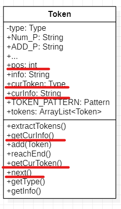

##### 迭代方法： 
迭代时只需要添加新增元素的正则表达式以及在`Type`中添加相应的符号种类即可
##### 迭代路径：
	hw1 识别ADD, SUB, MULT, NUM, LP, RP, VAR, EXP
	hw2 新增SUM SIN COS FUNC
	hw3 无 

#### 2.1.2Parser类构建表达式树状结构
运用递归下降法解析表达式，使用三个层次，表达式，项，因子。为每个层次、每个因子写好解析方法，递归的调用这些方法，就可以处理括号、因子的嵌套关系。对于求和函数和自定义函数，我选择将两者在解析这一步时就处理好，调用`Sum`和`Func`类中的方法，让其返回一个表达式因子加入到整个表达式树中。当遇到表达式前或者项中间的“-”号时，将其看作-1，作为常数因子添加在项中。比如$-(表达式)"="-1*表达式$，$x*-1 = x* -1 * 1$，

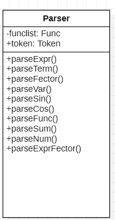

解析流程：

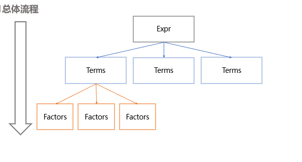

分析表达式 – 找出表达式中所有项，并加入这个表达式

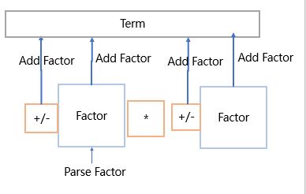

分析项—找出项中的所有因子，加入这个项中

随后再针对各类因子进行具体解析，特别的，如果遇到函数调用因子和求和因子，则调用这两类的方法，直接返回得到一个表达式因子。

##### 迭代方法
只需要添加新增因子的解析方法即可
##### 迭代路径
	hw1 解析`Expr` `Term` `Factor`(NUM VAR ExprFactor)
	hw2 新增解析`Factor`(SIN COS SUM FUNC)
	hw3 修改`SIN` `COS` `FUNC`的解析方法，使其可以解析因子嵌套

### 2.2表达式结构存储包（expressionPackege）
最终实现的架构如下
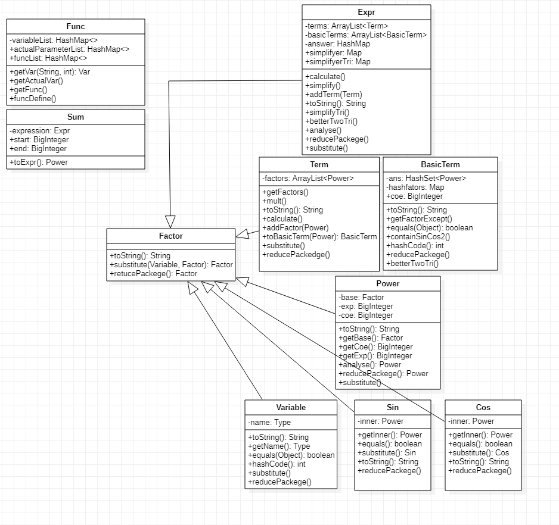

`Factor`：表示因子的抽象类

`Expr`：表达式，储存了这个表达式中所有的项，具有计算、化简等方法

`Term`：项，以ArrayList的形式储存了项中未进行乘法运算的因子，具有计算方法

`BasicTerm`：基本项，每一项在进行完乘法运算后都可以形成若干个基本项，以`coe`(系数)、`Map<Power, BigInteger>`(因子，指数) 的形式储存了乘法运算，指数合并后的结果

`Power`: 幂函数，在本架构中，所有的因子都以这种形式储存

`Variable`：变量

`Sin Cos`：三角函数

`Sum`：求和函数，解析后直接返回一个表达式因子

`Func`：自定义函数，解析后直接返回一个表达式因子

计算流程：

* 乘法：利用`BasicTerm`中的`Map<Power, BigInteger>`储存因子和其指数，如果已在map中则指数相加，系数相乘，如果不在则直接插入Map，两个BasicTerm相乘就是将两个HashMap进行合并，coe相乘
  
* 加法：利用`Expr`中的`Map<Map<Power,BigInteger>,BigInteger>`储存项和其系数，已在Map中则系数相加，不在则直接插入
  
* 三角优化：分为平方优化和Sin二倍角优化，Sin二倍角优化在`BasicTerm`内查找符合条件的因子并合并，平方优化在`Expr`的项间查着符合条件的项合并

#### 2.2.1本架构的优点
在解析时，将所有因子**统一**以 **系数\*底数\*\*指数** 的形式储存，也就是UML中的`Power`类。例如常数因子`5`表示为`5 * x ** 0`，将幂函数因子`x**5`表示成`1* x ** 5`，表达式因子则表示为系数为1，底数为表达式自身，指数为其指数的因子。 便于在括号展开时快速判断因子之间的相等关系，便于进行相同因子的指数处理（乘法），只需重写Power等因子的`equal`和`hashcode`方法，将其放入`BasicTerm`的`HashMap<Power,BigInteger>`，即可完成指数合并。

在计算时，**统一以BasicTerm类**储存所有项，`HashMap`自带equal，只需要将其作为key,系数作为value放入`Map<Map<Power,BigInteger>,BigInteger>`不需要重写equal便可以完成对同类项的系数合并，便于合并同类项（加法），也十分便于进行三角函数的化简。

#### 2.2.2本架构的缺点
 判断Sin因子和Cos因子是否相等（为同类）的时候，使用了Sin内部的因子的**toString**返回值是否相等的方式，这样可能使**数学意义上相等**的两个Sin被判定成不等，例如
$$
sin((x)) 、 sin(x)
$$
在本架构中会被判断成不等，并且在处理
$$
sin(cos(1))、cos(sin(0))
$$
等表达式数值化简的时候会产生不便。
为了解决这个问题，就必须为所有的因子编写 **“拆包装”** 方法，去掉一层层括号，将其中的最简单表达形式求解出来，这个过程比较复杂，也有很多容易忽略并且产生bug的点，在后文bug分析中会详细说明。

#### 2.2.3本架构的迭代路径
##### 作业一
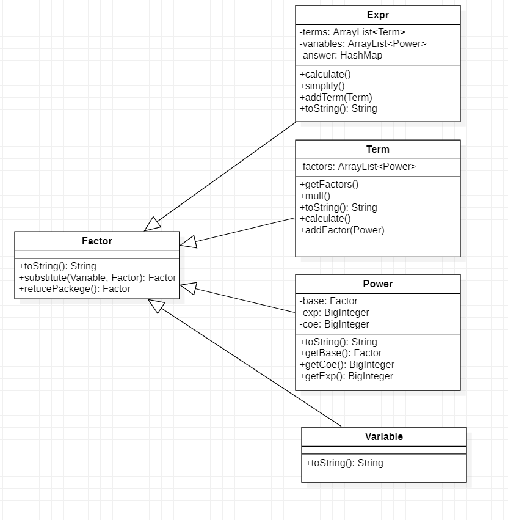
第一次作业形成了基本的表达式层次结构，从上到下，层次依次从高到底，用Power统一储存常数和变量，常数不单独设置一类。在优化方面，对于幂函数的输出进行了优化。

##### 作业二
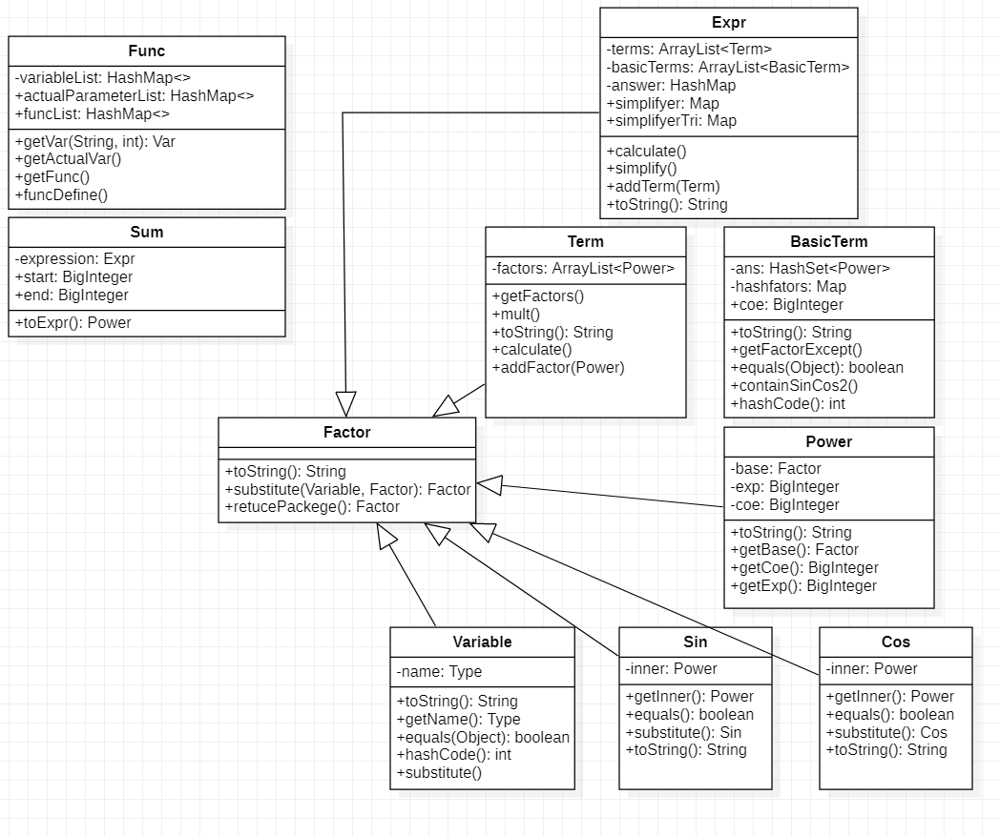

第二次作业相比第一次作业变化较大，主要是因为添加了Sin和Cos因子，这两个因子无法和之前的变量因子进行合并，于是导致计算后的每一项仅用Power无法描述，于是添加了新的一个BasicTerm类用来描述括号展开时合并指数后的项。另外，新增了求和函数类和自定义函数类，并且为了实现自定义函数和求和函数中涉及的代换，为每类表达式结构储存类都添加了substitute方法。在优化方面，主要添加了三角函数的平方优化。
##### 作业三


第三次作业相对于第二次作业没有架构上的大的改变，主要是在优化方面进行了一些调整。由于地单词作业开始支持三角函数内部嵌套表达式因子，那么区分三角函数内部的表达式因子是否可以用更简单的幂函数等其他因子替代将会对化简产生很大的影响，因此我添加了reducePackege方法，将深嵌套在层层结构中的实际上的简单因子拆掉外层的包装。并且添加了sin的二倍角公式优化。

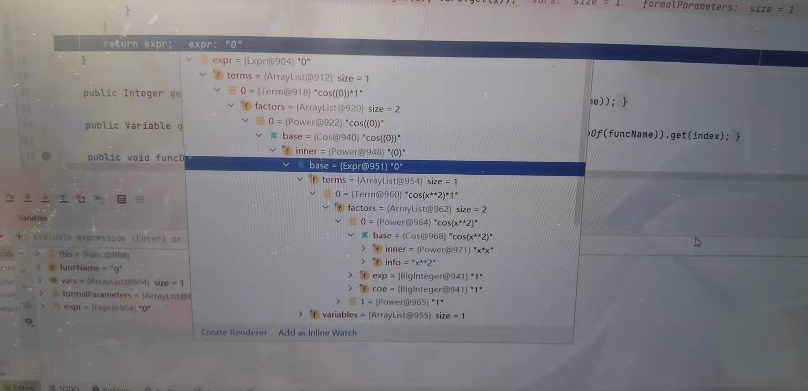
超级深嵌套，乐)

##### 总结
本架构在hw1的基础上，hw2的架构迭代增加较多，hw2到hw3几乎没有架构上的变动。整体上没有推倒重构，得益于在hw1就已经采用递归下降来处理嵌套括号，并设想了之后可能会增加因子种类该如何扩展。

## 三、度量分析
指标含义：
OC：类的非抽象方法圈复杂度
WMC：类的总圈复杂度
CogC:认知复杂度，反应一个方法的可理解性，循环分支等结构越多，可理解性越差，数值越高
ev(G):基本复杂度
iv(G):模块设计复杂度，衡量模块和其他模块的调用关系，越高说明模块和其他模块之间的调用关系复杂，耦合程度越高
v(G):判定结构复杂度，与程序的独立路径数量有关，越高说明程序越难以维护

### 3.1第一次作业
#### 代码规模
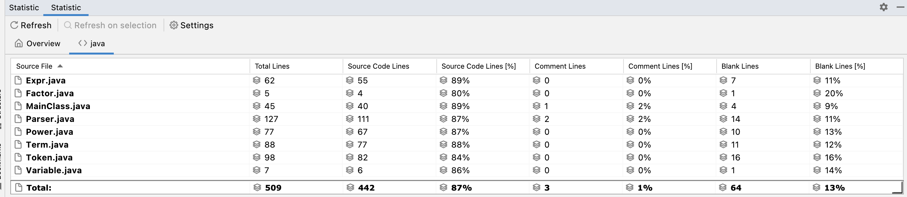
#### 复杂度分析
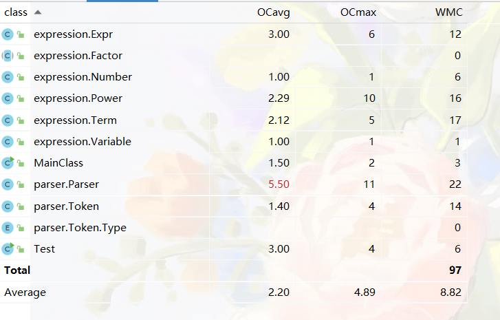
|method|CogC|ev(G)|iv(G)|v(G)|
|---|---|---|---|---|
|expression.Power.toString()|27.0   |2.0    |11.0   |11.0|
parser.Parser.pareFactor()  |27.0   |9.0    |11.0   |11.0|
parser.Parser.parseExpr()   |8.0    |4.0    |7.0    |7.0|
expression.Expr.toString()  |7.0    |3.0	|6.0	|6.0|
Test.main(String[])	        |9.0	|3.0	|5.0	|5.0
expression.Term.calculate()	|7.0	|1.0	|5.0	|5.0
parser.Parser.pareTerm()	|4.0	|1.0	|4.0	|4.0
parser.Token.extractTokens()|7.0    |4.0	|4.0	|4.0
expression.Expr.simplify()	|4.0	|1.0	|3.0	|3.0
expression.Term.mult(Power, Power)	|3.0	|2.0	|3.0	|3.0
Total	|117.0	|65.0	|100.0	|105.0
Average	|2.659	|1.477	|2.272	|2.386

(由于篇幅限制只展示前10条数值较大的数据)

可以看出，复杂度主要集中在`Parser`和`Power`的`toString`优化中。行数最多的是`Parser`类。`Parser`的复杂度主要是由于表达式结构多变导致的，而`Power`的`toString`方法有如此高的复杂度，可能归咎于我的优化方法主要依靠分类讨论实现，有大量的分支。

### 3.2第二次作业
#### 代码规模
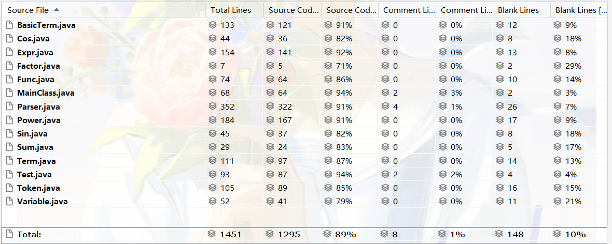
#### 复杂度分析
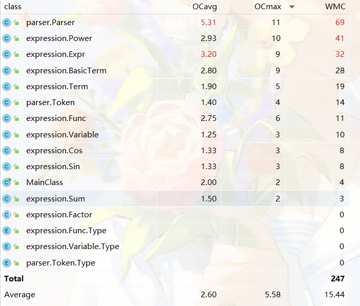
|method|CogC|ev(G)|iv(G)|v(G)|
|---|---|---|---|---|
expression.Power.toString()	|28.0	|3.0	|11.0	|11.0
expression.Expr.simlifyTri()	|31.0	|6.0	|10.0	|10.0
parser.Parser.pareCos()	|17.0	|6.0	|10.0	|10.0
parser.Parser.pareSin()	|21.0	|7.0	|10.0	|11.0
expression.BasicTerm.toString()	|12.0	|5.0	|8.0	|9.0
parser.Parser.pareFactor()	|8.0	|8.0	|8.0	|8.0
expression.Power.toStringInCos()	|16.0	|2.0	|7.0	|7.0
expression.Power.toStringInSin()	|20.0	|2.0	|7.0	|7.0
expression.Term.calculate()	|8.0	|1.0	|7.0	|7.0
parser.Parser.pareSum()	|11.0	|3.0	|7.0	|7.0
parser.Parser.parseExectParameter()	|7.0	|5.0	|7.0	|7.0
parser.Parser.parseExpr()	|8.0	|4.0	|7.0	|7.0
expression.Func.funcDefine(Token, Expr)	|12.0	|4.0	|6.0	|6.0
expression.BasicTerm.BasicTerm(Power)	|4.0	|1.0	|5.0	|5.0
expression.BasicTerm.containSinCos2()	|7.0	|4.0	|5.0	|5.0
expression.Expr.containSinCos2(Map<Power, BigInteger>)|	7.0	|4.0	|5.0	|5.0
expression.Expr.toString()	|7.0	|1.0	|5.0	|5.0
expression.Power.substitute(Variable, Factor)	|13.0	|6.0	|5.0	|6.0
parser.Parser.pareExprFactor()	|9.0	|4.0	|5.0	|5.0
parser.Parser.pareTerm()	|4.0	|1.0	|4.0	|4.0
Total	|314.0	|172.0	|246.0	|266.0
Average	|3.305	|1.810	|2.589	|2.8

(由于篇幅限制只展示前20条数值较大的数据)

第二次作业的行数之最还是集中在了`Parser`类，其次就是`Power`类。`Parser`是最重要的输入处理类，而Power在我的架构中是最基本的输出单位，可见对输入的处理是一件需要考虑很多细节的复杂工作，很容易出错。复杂度指标与第一次相比整体上略有提升，但是还可以接受，主要集中在`Parser`、`Power`、`Expr`、`BasicTerm`这几个类中。`Parser`、`Power`分别负责输入输出，`Expr`和`BasicTerm`主要负责计算和化简。
### 3.3第三次作业
#### 代码规模
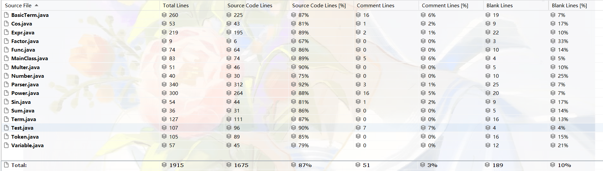
#### 复杂度分析
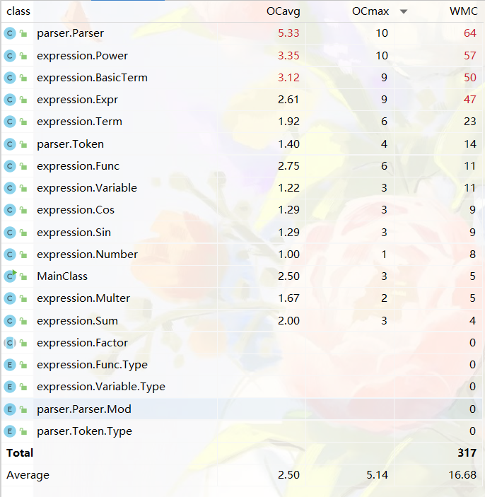
|method|CogC|ev(G)|iv(G)|v(G)|
|---|---|---|---|---|
expression.Power.Power(BigInteger, Factor, BigInteger)	|27.0	|1.0	|12.0	|12.0
expression.Power.toString()	|28.0	|3.0	|11.0	|11.0
expression.Expr.simlifyTri()	|31.0	|6.0	|10.0	|10.0
parser.Parser.parseCos(Mod)	|16.0	|5.0	|10.0	|11.0
parser.Parser.parseFactor(Mod)	|9.0	|8.0	|10.0	|10.0
parser.Parser.parseSin(Mod)	|20.0	|6.0	|10.0	|12.0
expression.BasicTerm.toString()	|12.0	|5.0	|8.0	|9.0
expression.Term.calculate()	|11.0	|1.0	|8.0	|8.0
expression.BasicTerm.containsTriPair(BigInteger)	|17.0	|7.0	|7.0	|8.0
expression.Power.toStringInCos()	|16.0	|2.0	|7.0	|7.0
expression.Power.toStringInSin()	|20.0	|2.0	|7.0	|7.0
parser.Parser.parseExpr(Mod)	|8.0	|4.0	|7.0	|7.0
parser.Parser.parseSum(Mod)	|11.0	|3.0	|7.0	|7.0
expression.Func.funcDefine(Token, Expr)	|12.0	|4.0	|6.0	|6.0
expression.BasicTerm.BasicTerm(Power)	|4.0	|1.0	|5.0|	5.0
expression.BasicTerm.betterTwoTri()	|6.0	|1.0	|5.0	|5.0
expression.BasicTerm.containSinCos2()	|7.0	|4.0	|5.0	|5.0
expression.Expr.containSinCos2(Map<Power, BigInteger>)	|7.0	|4.0	|5.0	|5.0
expression.Expr.toStingBetterwTir()	|7.0	|1.0	|5.0	|5.0
expression.Expr.toString()	|7.0	|1.0	|5.0	|5.0
Total	|411.0	|219.0	|320.0	|351.0
Average	|3.236	|1.724	|2.519	|2.763

(由于篇幅限制只展示前20条数值较大的数据)

第三次作业相比第二次作业改动较小，主要添加都在优化方面。可以发现，第三次作业相比第二次作业代码量从1.4k增长到1.9k，但平均复杂度却略有下降，可能是因为新增了很多方法降低了模块间的耦合度。可以发现这次的复杂度大户中新多出一位`Power`的构造方法，出现它的原因是距离第三次作业截止时间还有1小时的时候发现了一个bug，关于`sin`内因子提出负号不完全导致的，在紧急抢修的情况下，没有进行很好的设计，而是匆忙的在构造方法上打补丁，最终卡着CheckStyle阈值60行完成了方法，最终造就了一个复杂度高的方法。由此可见，写代码之前的设计工作是很重要的，不经过设计直接写就会导致代码复杂度高从而容易出现bug。

## 四、bug与测试分析
### 4.1、在测试过程中发现的bug以及互测时发现他人的bug
由于前两次作业在提交前的测试比较充分，没有在公测、强测和互测中发现bug，第三次在公测中被发现一个bug，解决后没有在强测和互测中被发现bug。
以下是我在调试和互测过程中发现的典型bug：
1. 指数部分无法解析包含符号的整数
   
   exp: 
   $$x**+02$$
2. 求和因子内部无法解析负数
   
   exp:
   $$sum(i,-3,-2,i)$$
3. 表达式因子代入时容易出错
   
   exp:

   $$
   g(x) = sin(x)\\
   g((sin(x)+x))
   $$

4. 三角因子内部缺少括号(提负号不完全)
   
   exp:
    $$sin(sin(-1)) =sin(-sin(1))$$
5. 优化时没有考虑三角因子的指数 
   
    exp:
     $$sin(-1)**2 = -sin(1)**2$$
6. 自定义函数形参表顺序不是x、y、z引起的错误带入

    exp:
    $$
    g(y,x) = y + x \\
    g(x, x**2) 
    $$

7. sum因子中上下界使用int储存
   $$
   sum(i,1234567890,1234567890,i)
   $$

### 4.2、测试方法与体会

#### 测试方法

我的测试主要分为自动化评测和手动构造样例两部分。

##### 自动化测试
自动化测试主要分为数据生成和答案检测两方面。

数据生成方法和递归下降方法类似，只需要按照表达式结构随机生成因子，通过控制递归深度和因子个数来控制式子整体的复杂度。

答案检测方面，我使用了python的sympy库的equal方法。第一次作业中，由于输入式子可以与程序输出直接比较，因此采用了输入和输出相等来判断对拍。第二次第三次作业由于涉及自定义函数代入和求和函数的计算，给答案检测带来了困难，因此我选择了和小伙伴进行对拍的方式。

##### 人工构造数据
人工构造数据的重点就是要尽可以找到数据的基本单元，对其进行分类讨论，再把基本单元进行排列组合，构造出数据，尽可能覆盖程序的所有分支。

##### 测试效果检验
感觉测试的充分与否与强测成绩和互测成绩有着很强的相关性，我打算从强测与互测成绩分析我的测试。

###### 强测

由于事先的测试还算比较充分，因此在强测中没有被发现bug。在保证正确性的情况下，我们可以通过强测性能分反应我们的优化效果。

**第二次失分测试点**

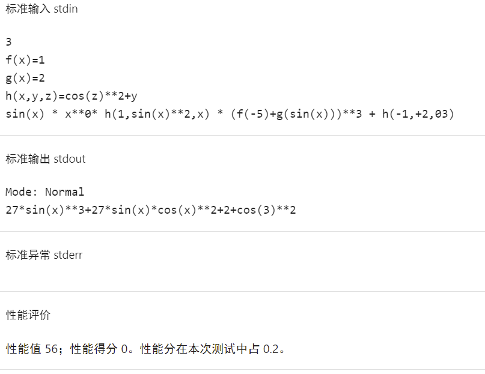


**第三次失分测试点**

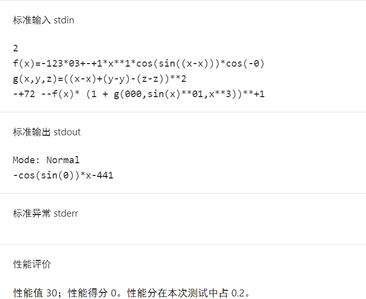

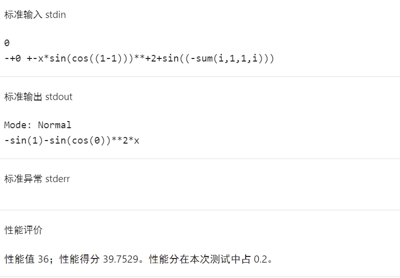

可以看出，在第二次强测中，因为三角平方优化不够完全而导致有个点性能分较差，而第三次强测中，没有考虑到三角嵌套中的化简，导致丢失很多性能分。

可见，大量随机测试虽然可以较大程度的保证正确性，但对于优化方面没有太多贡献，对于优化是否全面，还是需要勤快一点，构造测试数据并且人工检查一下优化彻底与否

###### 互测：

三次互测战绩


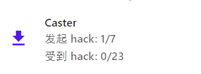

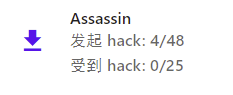

**第一次测试**和互测时我采用了完全随机的方式，但是我只找到了一个bug，还有一个bug是无法处理+00这种数据，但没有被测出来。从这次互测我发现一个问题，就是数据bug数量大于程序bug数量，随机生成的数据中有很多无法满足形式化表达（也是由于数据生成写的比较仓促）和互测要求，大大降低了测试的效率。并且，大量随机测试对于边界数据的测试可能不够充分，实际上效率并不高。

**第二次测试**和互测由于时间关系，没有写出带有三角因子和函数带入的脚本，因此我采用了完全手造数据的方法测试，由于是手造数据，对边界数据的测试比较充分，在数据的合法性也有所保证，很快就找到了房间中的所有bug(也可能是因为这次房间里只有一个bug)。

**第三次测试**由于因子嵌套规则更加自由，手动构造数据分支有点多，因此采用了自动生成数据结合手动构造数据的方式测试。在提交之前，大部分bug是通过大规模随机测试筛查出的，但在这次互测中，互测屋内找到的bug均为手动构造的边界数据。可以看出，前期随机测试找bug效率较高，但后期通过构造数据能够更加精准的找到bug

有一个bug不得不在这里提一提，就是关于自定义函数形式形参表的第一个参数不是x的时候，会造成参数重复带入的问题，因为三个实参不是同时带入形参的，带入前面的实参的时候会引入实参中的x，在后面的形参还有x的时候，就会前面实参中的x也代换掉，造成bug

例如：

$$
g(y,x) = y + x \\
    g(x, x**2) 
    \\正确输出：x+x**2
    
    \\错误输出：2*x**2
$$

但这个bug我是在互测已经开始时，看到群佬在水群讨论才突然惊醒！但是为什么没有在之前的测试中找到呢，原来和我对拍的小伙伴非常巧合的也出现了这个bug！看来答案的检测也不能过分依赖对拍脚本，对于人工构造一些数据，还是尽量人工算出正确答案再进行检查。再不得不提一提的是，这个bug强测竟然没有测，互测也无法提交自定义函数，于是很幸运的逃过一劫，乐:)))。
## 五、收获与体会

通过完成第一单元的OO作业，我有以下几点收获

* 快速熟悉起了java的常用类，比如HashMap等容器
  
* 体会到了和学习C程序设计完全不一样的编程体验，体会到“不要重复造轮子”的含义，有很多基础功能是java的类中已经实现好的，直接使用即可，这样可以更专注于架构的设计，不会过于陷入细节。
  
* 体会到了架构设计的重要性，一定要先进行设计工作，再进行编码工作，我发现从设计到写出伪代码，再到写出代码这个过程是一步一步细化到细节的，是比一下子就开始写代码，陷入最底层的细节要高效很多的
  
* 体会到了面向对象编程的层次化结构，发现与面向过程的程序设计不同，面向对象的程序设计更加贴近现实世界，像是在用代码描述这些对象和对象间的关系，更符合人在观察世界时的逻辑。

OO第一单元终于完结撒花啦！！虽然在寒假里完成了pre，可是当第一周打开题目的时候还是被吓了一跳，感觉完全没有思路，于是陷入焦虑中，在坎坷中通过Training、学长的博客和讨论区佬们的帖子找到一些思路，完成架构的设计，最终完成了一周前看起来不可能的任务。这个过程在第二周又轮回重复了一遍，初期还是同样的迷茫，感觉蚌埠住了，然后渐渐找到思路，到最终完成架构设计的豁然开朗。到第三周已经习惯这个心态节奏了，也因为已经有了架构，度过的还算顺利。总之第一单元的OO作业让我在知识和心态方面都有所提升，希望之后的OO学习一切顺利！

<!--结尾彩蛋&特别鸣谢-->
<!--叶学长：帮我找到一个我百思不解的bug，原来toString方法更改了对象状态！！！-->
<!--王钧石同学：感谢思路的开拓和对拍！！！！-->
<!--讨论区的佬们：感谢佬们分享的各种思路！！！！-->